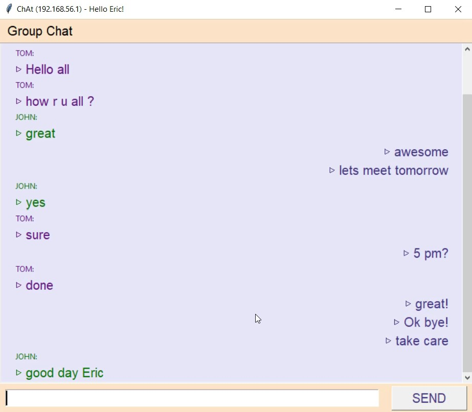

# Python-chat-server
A group chat program in Python language using Socket programming.
### 🔹 Socket using connectionless protocol, UDP.
### 🔹 Graphical User Interface using tkinter library.
### 🔹 Threading in Python.

#### create a socket with ip and port number,
```python
import socket
s = socket.socket(socket.AF_INET, socket.SOCK_DGRAM)
ip = "0.0.0.0"       # for all IP addresses of your system
port = 81            # any unsed port number
s.bind((ip, port))
```

#### Add all other systems (chat servers) in the users dictionary with key=IP and value=[name, any_color_for_text],
```python
users = {"192.168.56.102": ["JOHN", "dark green"],
         "192.168.56.103": ["TOM", "DarkOrchid4"]}
```

### Creating a thread for recieve() function that runs an infinite loop to keep recieving and printing data,
```python
from threading import Thread
t = Thread(target=recieve)
t.daemon = True
t.start()
```
If we directly call the recieve() function, the program will get into infinite loop and further code will not be executed that includes ```root.mainloop()```
which helps to continuously display the GUI window by putting it in an infinite loop. Also if we call recieve() after ```root.mainloop()```, it would be executed only after we close the window (break the loop). So, We want to run both of these loops together and we can do so with help of threading.

tkinter library of python for GUI,

Added a textfield (Entry) at the bottom. When clicked on SEND button, it will invoke clicked() function, the text (non-empty) will be sent to all users and also printed on frame of the window.

### Watch the demo,

https://user-images.githubusercontent.com/64186894/119156279-b410c200-ba71-11eb-8a7d-284362322aab.mp4
